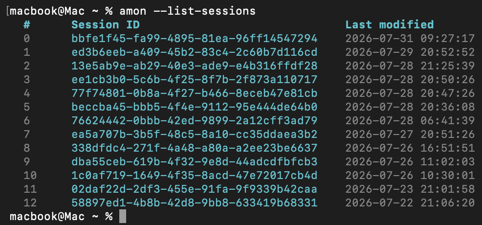

# CLI

Entry point: `scripts/amon/amon_cli.py` (installed as `amon`).

## Modes

| Mode | How | Behavior |
|------|-----|----------|
| Interactive | `amon` | REPL with slash commands, tool confirmation UI |
| Headless | `amon --headless "…"` | Single task via `spawn_agents`, prints result |
| Session admin | `--list-sessions`, `--delete-session`, `--keep-N-sessions` | No agent run |
| Agent admin | `--list-agents` | Print loaded agents and exit |

## Common invocations

```bash
amon
amon --agent planner
amon --resume
amon --resume-id 13e5ab9e-ab29-40e3-ade9-e4b316ffdf28
amon --list-sessions
amon --list-agents
amon --delete-session 13e5ab9e-ab29-40e3-ade9-e4b316ffdf28
amon --keep-N-sessions 5
amon --headless "list python packages in this repo" --agent default
amon --headless "list python packages in this repo" --json
```

## Flags

Full table (exit behavior, types, defaults): [amon-author reference](examples/skills/amon-author/references/cli-flags.md).

| Flag | Purpose |
|------|---------|
| `--agent NAME` | Agent JSON stem to load (default: `default`) |
| `--resume` / `-r` | Pick a session interactively |
| `--resume-id UUID` | Resume a specific session |
| `--list-sessions` | Print sessions and exit |
| `--list-agents` | Print loaded agents (`name: description`) and exit |
| `--delete-session UUID` | Delete one session |
| `--keep-N-sessions N` / `-keep N` | Keep only N newest sessions |
| `--headless INPUT` | Non-interactive single prompt |
| `--json` | Headless only: print the result as JSON on stdout (pipe-clean). Errors if used without `--headless` |
| `--save-session` | Headless only: save the session (see below) |

Session saving differs by mode:

- **Interactive**: always saves — every turn runs with `save_session_=True` hardcoded.
- **Headless CLI**: does **not** save by default. Pass `--save-session` to persist.
- **`spawn_agents` (API/tool)**: also defaults `save_session=false` per job; set
  `save_session: true` on a job to persist.

## Interactive slash commands

Typed at the `>` prompt (must be exact matches unless noted):

| Command | Effect |
|---------|--------|
| `/exit`, `/quit`, `/q` | Leave the REPL |
| `/agent` | Pick another loaded agent |
| `/sessions` | List sessions |
| `/new` | Fresh session id + reset context footer |
| `/compact` | LLM-summarize the current session transcript |

Unknown `/…` commands print a dim “not a command” message.

## Session flow (interactive)

1. Resolve session id (new UUID, `--resume-id`, or picker via `--resume`)
2. Load agent from `READY_AGENTS[args.agent]`
3. Each user message calls `run_agent(…)` with:
   - `system_prompt` from agent config
   - tool registry from `tools` + `allowed_tools`
   - skill catalog from `allowed_skills`
   - `hooks` from agent config

## Headless flow

```text
amon --headless TASK --agent NAME [--json] [--save-session]
  → spawn_agents([{agent: NAME, task: TASK, save_session: …}])
  → Agent.run_task (headless=True)
  → print result (rich panels) or JSON if --json
```

### `--json` output

With `--headless --json`, amon writes a single JSON object to stdout (no spinner/rich
noise) and exits `0` on success / `1` on failure. Shape comes from `spawn_agents` via
`_headless_payload`:

```json
{
  "ok": true,
  "agent": "default",
  "task": "list python packages in this repo",
  "result": "…",
  "error": null,
  "usage": {
    "prompt_tokens": 0,
    "completion_tokens": 0,
    "total_tokens": 0
  },
  "turns": 1,
  "tools_used": [],
  "session_id": null
}
```

`usage` fields are **full-run sums** across turns (not last-turn only).
When `ok` is false (unknown agent, exception, max turns), check `error`; `result`
may still hold partial content (especially on max-turns).

If multiple jobs were spawned, the payload is `{ "ok": <all ok>, "results": [ … ] }`.
Without `--json`, the same data is rendered with `terminal.print_headless_result`.
`--json` without `--headless` is rejected by the CLI.

## Sample output

`--list-sessions` (`terminal.print_sessions`):



`--list-agents` prints one line per loaded agent from `READY_AGENTS` (`_AGENT_DESCRIPTION_STR`):

```text
- default: General-purpose default agent with access to all available tools and skills…
- planner: Takes a task and restructures it into a clear, ordered step-by-step plan…
```

If none are configured, it prints `No agents configured.`

`--headless` result (`terminal.print_headless_result`) — one panel per job, title
`agent — task`, body as Markdown, then a dim meta line when available:

```text
╭─ default — list python packages in this repo ────────────────────╮
│ Found 3 packages: shared, scripts.amon, config                   │
╰──────────────────────────────────────────────────────────────────╯
tokens=1434 · turns=3 · tools=shell_readonly, read_file
```

Failed jobs use a red panel with `error` instead of the result body.

Interactive mode opens with a welcome panel (`terminal.show_welcome`) showing the
agent name and slash-command hints, then replays prior turns if `--resume`/`--resume-id`
loaded an existing session. A footer tracks token usage against the context limit
fetched once at startup via `_init_context_limit` (`get_context_window`).

Ctrl+C during an interactive `run_agent` hard-cancels the current run (no delayed
receive of the in-flight LLM response). ESC is not a cancel key.
